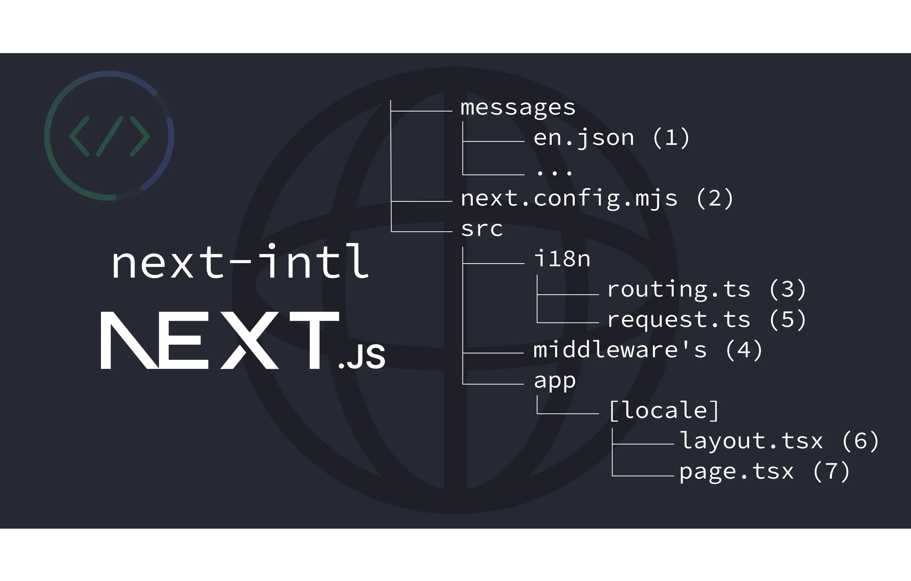

# Next.js i18n

This repository demonstrates how to set up **Next.js** with internationalization (**i18n**) using [`next-intl`](https://next-intl.dev/docs/getting-started/app-router/with-i18n-routing). The setup supports both **client-side** and **server-side** translations and provides a scalable structure for multi-language applications.

---

## Features

- **Dynamic Translations**: Translations loaded dynamically for server and client components.
- **Locale Detection**: Middleware automatically redirects users based on their browser's preferred language.
- **Reusable Components**: Clean and modular structure for maintaining translations and layouts.
- **Two Languages Supported**: English (`en`) and Ukrainian (`uk`).

---

## Project Structure



---

## Getting Started

### 1. Clone the Repository

```bash
git clone https://github.com/Olena-P/next-i18n-demo.git
cd next-i18n-demo
```

### 2. Install Dependencies

```bash
npm install
```

### 3. Run the Development Server

```bash
npm run dev
```

Visit `http://localhost:3000/en` or `http://localhost:3000/uk` to explore the application.

---

## Key Files

- **Middleware**: Handles locale detection and redirection ([middleware.ts](https://github.com/Olena-P/next-i18n-demo/blob/master/src/lib/middleware.ts)).
- **Routing**: Defines available locales and fallback logic ([routing.ts](https://github.com/Olena-P/next-i18n-demo/blob/master/src/i18n/routing.ts)).
- **Translation Logic**: Manages loading translations ([i18nHelpers.ts](https://github.com/Olena-P/next-i18n-demo/blob/master/src/lib/i18nHelpers.ts)).
- **Locale Layout**: Applies per-locale settings ([layout.tsx](https://github.com/Olena-P/next-i18n-demo/blob/master/src/app/%5Blocale%5D/layout.tsx)).

---

## Contributing

Feel free to fork the repository, open issues, and submit pull requests for improvements.
